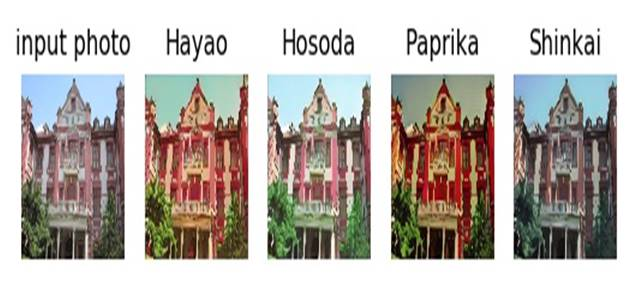
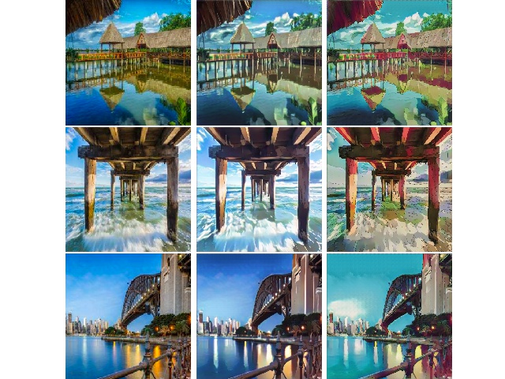

# Keras-CartoonGan

keras version of [CartoonGan](http://openaccess.thecvf.com/content_cvpr_2018/papers/Chen_CartoonGAN_Generative_Adversarial_CVPR_2018_paper.pdf).

* photo: 
* cartoonized: 


## 0. Requirement

* python 3.6
* tensorflow 1.13.1
* Pillow
* matplotlib
* etc.

I recommend that you create and use an anaconda env that is independent of your project. You can create anaconda env for this project by following these simple steps. This process has been verified on Windows 10 and ubuntu 16.04.

```
$ conda create -n cartoon python=3.6
$ activate cartoon # in linux "source activate cartoon"
(cartoon) $ pip install tensorflow==1.13.1
(cartoon) $ pip install pillow
(cartoon) $ pip install matplotlib
```

## 1. Convert Image to Cartoon

You can generate cartoonized image through the following command.

```
project/root> python main.py -i sample_in/sjtu.jpg
```

You can see the following result.




## 2. Reproduce Paper Results

<table align='center'>
<tr align='center'>
<td> Paper Result </td>
<td> My Result (This Repo.) </td>
</tr>
<tr align='bottom'>
<td>
<td>
</tr>

If you just run [main.py](https://github.com/penny4860/Keras-CartoonGan/blob/master/main.py), you can reproduce the above results!


